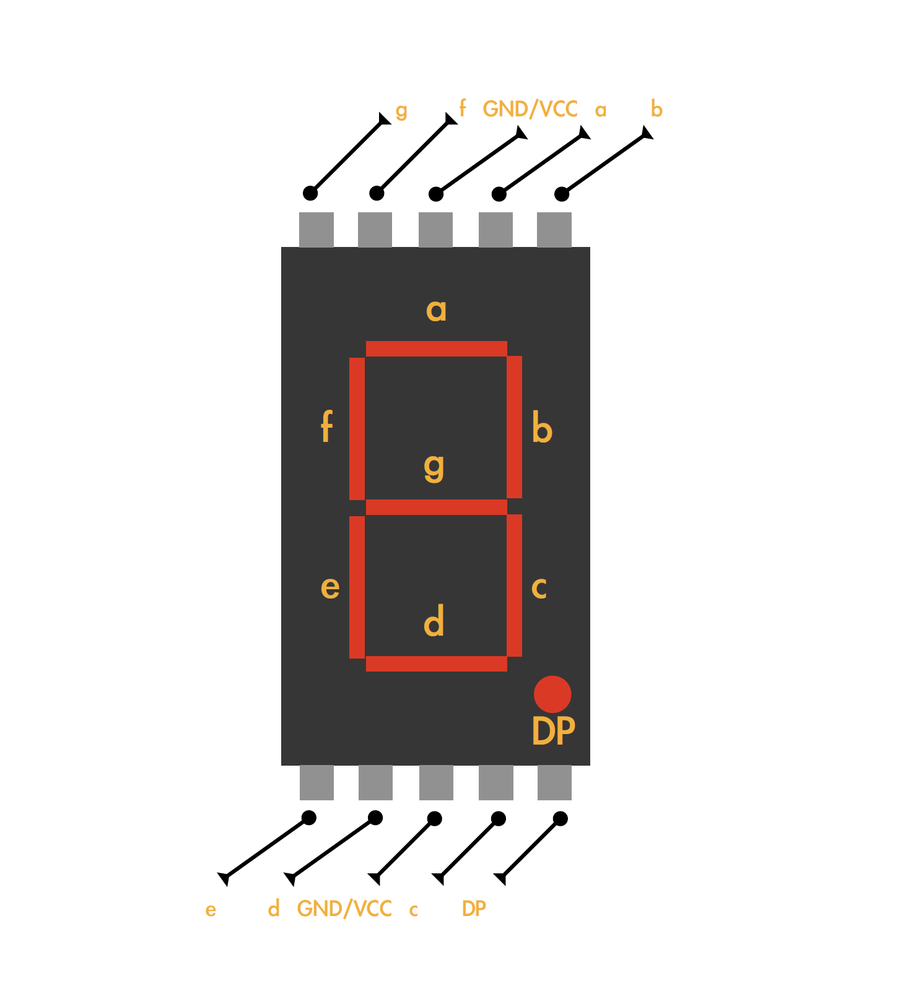

# 7 - segment 4-bit to HEX converter

### By Vasily Davydov
> Idea was inspired by [Ben Eater](https://github.com/beneater) 

#### The main idea of this project is to have 4 inputs which you can operate to display input-related numbers in HEX on a 7-segment display
***
> Down below you can see a *truthtable* I made for this project and an image of a 7-segment display with a letter on every diode:

| Input 1 | Input 2 | Input 3 | Input 4 |   | a | b | c | d | e | f | g | num | HEX |
|---------|---------|---------|---------|---|---|---|---|---|---|---|---|-----|-----|
| 0       | 0       | 0       | 0       |   | 1 | 1 | 1 | 1 | 1 | 1 | 0 | 0   | 0   |
| 0       | 0       | 0       | 1       |   | 0 | 1 | 1 | 0 | 0 | 0 | 0 | 1   | 1   |
| 0       | 0       | 1       | 0       |   | 1 | 1 | 0 | 1 | 1 | 0 | 1 | 2   | 2   |
| 0       | 0       | 1       | 1       |   | 1 | 1 | 1 | 1 | 0 | 0 | 1 | 3   | 3   |
| 0       | 1       | 0       | 0       |   | 0 | 1 | 1 | 0 | 0 | 1 | 1 | 4   | 4   |
| 0       | 1       | 0       | 1       |   | 1 | 0 | 1 | 1 | 0 | 1 | 1 | 5   | 5   |
| 0       | 1       | 1       | 0       |   | 1 | 0 | 1 | 1 | 1 | 1 | 1 | 6   | 6   |
| 0       | 1       | 1       | 1       |   | 1 | 1 | 1 | 0 | 0 | 0 | 0 | 7   | 7   |
| 1       | 0       | 0       | 0       |   | 1 | 1 | 1 | 1 | 1 | 1 | 1 | 8   | 8   |
| 1       | 0       | 0       | 1       |   | 1 | 1 | 1 | 1 | 0 | 1 | 1 | 9   | 9   |
| 1       | 0       | 1       | 0       |   | 1 | 1 | 1 | 0 | 1 | 1 | 1 | 10  | A   |
| 1       | 0       | 1       | 1       |   | 0 | 0 | 1 | 1 | 1 | 1 | 1 | 11  | b   |
| 1       | 1       | 0       | 0       |   | 1 | 0 | 0 | 1 | 1 | 1 | 0 | 12  | C   |
| 1       | 1       | 0       | 1       |   | 0 | 1 | 1 | 1 | 1 | 0 | 1 | 13  | d   |
| 1       | 1       | 1       | 0       |   | 1 | 0 | 0 | 1 | 1 | 1 | 1 | 14  | E   |
| 1       | 1       | 1       | 1       |   | 1 | 0 | 0 | 0 | 1 | 1 | 1 | 15  | F   |

***
### Forming a Boolean equation for making a logic circuit:

Firstly I had to make an equation for every output and simplify it, so I can build a logical circuit out of it. 

An equation for **a**:

**F(a)**= !a!b!c!d+!a!bc!d+!ab!cd+!abc!d+!abcd+a!b!c!d+a!b!cd+a!bc!d+ab!c!d+abc!d+abc!d+abcd

Simplified: 

**F(a)**= a!b!c+!abd+!b!d+!ac+a!d+bc

