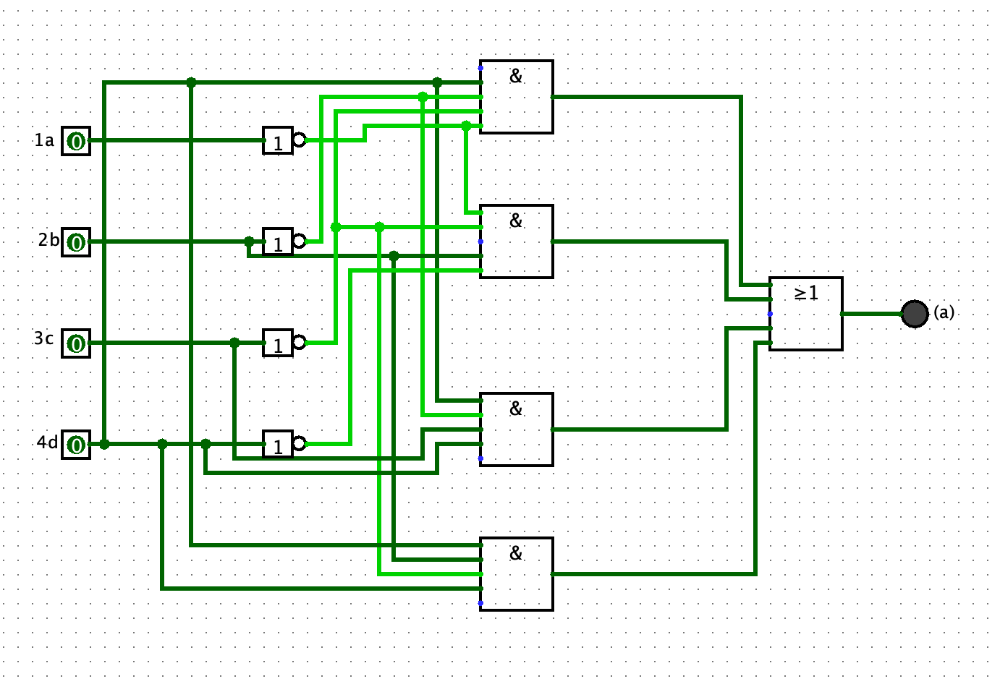

# 7 - segment 4-bit to HEX converter

### By Vasily Davydov (IN PROGRES)
> Idea was inspired by [Ben Eater](https://github.com/beneater) 

#### The main idea of this project is to have 4 inputs which you can operate to display input-related numbers in HEX on a 7-segment display
***
> Down below you can see a *truthtable* I made for this project and an image of a 7-segment display with a letter on every diode:

| Input 1 | Input 2 | Input 3 | Input 4 |   | a | b | c | d | e | f | g | num | HEX |
|---------|---------|---------|---------|---|---|---|---|---|---|---|---|-----|-----|
| 0       | 0       | 0       | 0       |   | 1 | 1 | 1 | 1 | 1 | 1 | 0 | 0   | 0   |
| 0       | 0       | 0       | 1       |   | 0 | 1 | 1 | 0 | 0 | 0 | 0 | 1   | 1   |
| 0       | 0       | 1       | 0       |   | 1 | 1 | 0 | 1 | 1 | 0 | 1 | 2   | 2   |
| 0       | 0       | 1       | 1       |   | 1 | 1 | 1 | 1 | 0 | 0 | 1 | 3   | 3   |
| 0       | 1       | 0       | 0       |   | 0 | 1 | 1 | 0 | 0 | 1 | 1 | 4   | 4   |
| 0       | 1       | 0       | 1       |   | 1 | 0 | 1 | 1 | 0 | 1 | 1 | 5   | 5   |
| 0       | 1       | 1       | 0       |   | 1 | 0 | 1 | 1 | 1 | 1 | 1 | 6   | 6   |
| 0       | 1       | 1       | 1       |   | 1 | 1 | 1 | 0 | 0 | 0 | 0 | 7   | 7   |
| 1       | 0       | 0       | 0       |   | 1 | 1 | 1 | 1 | 1 | 1 | 1 | 8   | 8   |
| 1       | 0       | 0       | 1       |   | 1 | 1 | 1 | 1 | 0 | 1 | 1 | 9   | 9   |
| 1       | 0       | 1       | 0       |   | 1 | 1 | 1 | 0 | 1 | 1 | 1 | 10  | A   |
| 1       | 0       | 1       | 1       |   | 0 | 0 | 1 | 1 | 1 | 1 | 1 | 11  | b   |
| 1       | 1       | 0       | 0       |   | 1 | 0 | 0 | 1 | 1 | 1 | 0 | 12  | C   |
| 1       | 1       | 0       | 1       |   | 0 | 1 | 1 | 1 | 1 | 0 | 1 | 13  | d   |
| 1       | 1       | 1       | 0       |   | 1 | 0 | 0 | 1 | 1 | 1 | 1 | 14  | E   |
| 1       | 1       | 1       | 1       |   | 1 | 0 | 0 | 0 | 1 | 1 | 1 | 15  | F   |

***
### Forming a Boolean equation for making a logic circuit:

Firstly I had to make an equation for every output and simplify it, so I can build a logical circuit out of it. 

I had two choices on how to make it:

> In the common **cathode display**, all the cathode connections of the LED segments are connected together to ‘logic 0’ / GND. The individual > segments are then illuminated by applying HIGH / ’logic 1’ signal to the individual Anode terminals (a-g).

OR

> In the **common anode** display, all the anode connections of the LED segments are joined together to logic “1”. The individual segments are
> illuminated by applying a ground, logic “0” or “LOW” signal to the Cathode of the particular segment (a-g).

This explanation is taken from [this Website](https://lastminuteengineers.com/seven-segment-arduino-tutorial/)

So I planned to use the **common anode** way, because the truth table has less zero's than one's.
> **IN THIS CASE NOT CHANGING THE TRUTH TABLE MEANS THAT ON THE LOGIC CIRCUIT THE INPUT PATTERN WILL GIVE THE OPPOSITE OUTPUT (F.E. 0001 WILL GIVE 1)**

- All the following Logic circuits can be found [here](LogicCircuits)
- a = Input 1, b = Input 2, c = Input 3, d = Input 4

### Equation for (a) and the following circuit:

#### F = !a!b!cd+!ab!c!d+a!bcd+ab!cd

